# 5. Speak Like a Pro: Public Speaking for Professionals
    https://toptal.udemy.com/course/speak-like-a-pro-public-speaking-for-professionals/

* Welcome
    1. Why Public Speaking Matters - [01.Speak+Like+a+Pro+Glossary+of+Key+Terms+-+www.jenniferhennings.com.pdf](https://github.com/mkader/Public-Speaking-to-Become-a-Leader/blob/main/Public%20Speaking%20-%20Foundational/5.%20Speak%20Like%20a%20Pro%3A%20Public%20Speaking%20for%20Professionals/01.%20Speak%20Like%20a%20Pro%20Glossary%20of%20Key%20Terms.pdf)
    2. Exercise: Visualize Your Success - [02.My+Communication+Goals+and+Vision+F.pdf](https://github.com/mkader/Public-Speaking-to-Become-a-Leader/blob/main/Public%20Speaking%20-%20Foundational/5.%20Speak%20Like%20a%20Pro%3A%20Public%20Speaking%20for%20Professionals/02.%20My%2BCommunication%2BGoals%2Band%2BVision%2BF.pdf)   
    3. Know Your Communication Contexts - [03.My+Communication+Contexts+F.pdf](https://github.com/mkader/Public-Speaking-to-Become-a-Leader/blob/main/Public%20Speaking%20-%20Foundational/5.%20Speak%20Like%20a%20Pro%3A%20Public%20Speaking%20for%20Professionals/03.%20My%2BCommunication%2BContexts%2BF.pdf)

* Analyze Your Audience
    1. Exercise: Why Audience Comes First - Always! - [04. Know+Who's+in+the+Room+F.pdf](https://github.com/mkader/Public-Speaking-to-Become-a-Leader/blob/main/Public%20Speaking%20-%20Foundational/5.%20Speak%20Like%20a%20Pro%3A%20Public%20Speaking%20for%20Professionals/04.%20Know%2BWho's%2Bin%2Bthe%2BRoom%2BF.pdf)
    5. Exercise: Set Your 3-Part Speaking Goal - [05. Set+Your+3-Part+Speaking+Goal+F.pdf](https://github.com/mkader/Public-Speaking-to-Become-a-Leader/blob/main/Public%20Speaking%20-%20Foundational/5.%20Speak%20Like%20a%20Pro%3A%20Public%20Speaking%20for%20Professionals/05.%20Set%2BYour%2B3-Part%2BSpeaking%2BGoal%2BF.pdf)
    6. Exercise: Craft Your 12-Word Message - [06. Craft+Your+12-Word+Message+F.pdf](https://github.com/mkader/Public-Speaking-to-Become-a-Leader/blob/28ab4f4f19f60f653cc47ae3242f36159f0e5307/Public%20Speaking%20-%20Foundational/5.%20Speak%20Like%20a%20Pro%3A%20Public%20Speaking%20for%20Professionals/06.%20Craft%2BYour%2B12-Word%2BMessage%2BF.pdf)
    1. Quiz
        1. What is the very first step any speaker should take to prepare for a presentation?
            1. [ ] Set a goal for the presentation
            1. [x] Get to know who’s in the room
            1. [ ] Figure out the main message of the presentation
            1. [ ] Start designing slides
        2. What is the primary purpose of a 12-word message?
            1. [x] Your 12-word message helps you determine which supporting examples and content needs to go in your presentation and what information is distracting or irrelevant.
            1. [ ] Your 12-word message is something you should memorize and repeat as the last line of your presentation.
            1. [ ] Your 12-word message adds humor to your presentation.
            1. [ ] Your 12-word message is what you should use as the title of your presentation. 

* Structure Your Content
    1. How the Power of 3 Will Change Your Life
    8. The Power of Repetition: Introductions and Conclusions
    9. Exercise: Power of 3 - Your Turn
        1. [09.1.Power+of+3+-+Mind+Map+Version+F](https://github.com/mkader/Public-Speaking-to-Become-a-Leader/blob/489834ac3f5b756e4f2ecd2c92e4fe43d19069ba/Public%20Speaking%20-%20Foundational/5.%20Speak%20Like%20a%20Pro%3A%20Public%20Speaking%20for%20Professionals/09.1.Power%2Bof%2B3%2B-%2BMind%2BMap%2BVersion%2BF.pdf)
        1. [09.2.Power+of+3+-+Outline+Version+F](https://github.com/mkader/Public-Speaking-to-Become-a-Leader/blob/489834ac3f5b756e4f2ecd2c92e4fe43d19069ba/Public%20Speaking%20-%20Foundational/5.%20Speak%20Like%20a%20Pro%3A%20Public%20Speaking%20for%20Professionals/09.2.Power%2Bof%2B3%2B-%2BOutline%2BVersion%2BF.pdf)
    10. Quiz
        1. What is the Power of 3?
            1. [ ] The Power of 3 is a tool for organizing short introductions of 2 minutes or less.
            1. [ ] The Power of 3 is a strategy for getting to know your audience more closely.
            1. [ ] The Power of 3 is a framework for structuring long workshops of 2 hours or more.
            1. [x] The Power of 3 is a framework you can use to organize presentations of any length.
        2. What is the most helpful way to make your audience remember your main ideas?
            1. [ ] Tell your audience your main idea just once at the end of your presentation.
            1. [ ] Start with a story, deliver your main idea once in the middle, and then end with data.
            1. [x] Repeat your main message several times throughout your presentation.
            1. [ ] Share your examples and let your audience draw their own conclusions about your key message.
* Tell Your Story
    1. Become a Storytelling Expert - [Techniques](https://www.fastcompany.com/90297323/use-these-techniques-from-professional-speechwriters-will-help-get-your-point-across)
    11. Exercise: Build Your Story Bank - [11. Build+Your+Story+Bank+F.pdf](https://github.com/mkader/Public-Speaking-to-Become-a-Leader/blob/2a4cea71cf8ade578bd4b3507466ab615a3294f5/Public%20Speaking%20-%20Foundational/5.%20Speak%20Like%20a%20Pro%3A%20Public%20Speaking%20for%20Professionals/11.%20Build%2BYour%2BStory%2BBank%2BF.pdf)
    1. Quiz
        1. What is the primary value of adding stories to your presentation?
            1. [x] Stories make data and facts more relatable and memorable.
            1. [ ] Stories are a hot fad in leadership and business so you should use them to keep up with the times.
            1. [ ] Stories make people laugh.
            1. [ ] Stories build your credibility as a speaker.
        1. What is a story bank?
            1. [ ] A story bank is a list of stories that you want to avoid using in your presentations.
            1. [ ] A story bank is a group of stories drawn only from your own life.
            1. [x] A story bank is a collection of stories from your own life, lives of your customers, or lives of others.
            1. [ ] A story bank is one story you memorize and use in every presentation.
* Speak Like a Pro: Delivery Skills    
    1. Exercise: Know Your Speaking Baseline - [12. Know+Your+Speaking+Baseline+F](https://github.com/mkader/Public-Speaking-to-Become-a-Leader/blob/2a4cea71cf8ade578bd4b3507466ab615a3294f5/Public%20Speaking%20-%20Foundational/5.%20Speak%20Like%20a%20Pro%3A%20Public%20Speaking%20for%20Professionals/12.%20Know%2BYour%2BSpeaking%2BBaseline%2BF.pdf)
    13. How to Master Eye Contact
    14. What to Do With Your Hands
    15. Exercise: Stand Like a Speaker
    16. Like, You Need to Get Rid of, Um, Filler Words - [Like So App]( https://sayitlikeso.com/)
    17. How to Sound Natural - [Ben Stein From Ferris](https://www.youtube.com/watch?v=uhiCFdWeQfA)
    18. Pace Yourself
    19. Exercise: Speak Like a Pro
    1. Quiz 4: CPE Review Quiz: Section 5
        1. What makes eye contact such an important skill to master as a public speaker?
            1. [ ] Eye contact is important because it’s the only way to achieve connection with your audience.
            1. [x] Eye contact is important because it helps you achieve all 3 Cs: confidence, connection, and credibility.
            1. [ ] Eye contact is important because it helps improve your physical gestures.
            1. [ ] Eye contact is important because it helps you remember what you want to say as a speaker.
        1. What is the most effective posture to stand in as a speaker?
            1. [ ] “Starbucks stance” (weight shifted to one hip, shoulders rounded) is most effective because it makes you look comfortable.
            1. [ ] Any posture that feels good to your body is effective because what matters most is that you’re authentic to who you are.
            1. [x] “Speaker stance” (weight balanced on both hips, shoulders back and down) is most effective because it projects confidence to the audience.
            1. [ ] The most effective posture is to stand with your feet wider than your hips and put your hands on your hips.
        1. What is the most effective way to sound more natural as a speaker?
            1. [ ] Write out a script word for word and memorize it.
            1. [x] Practice out loud from bullet points.
            1. [ ] Create an outline but don’t speak it out loud until you’re in front of your audience.
            1. [ ] Think through your presentation in your head without making an outline.
* Think and Speak on Your Feet
    1. How to PREPare for the Unexpected - [20. PREP+Framework+for+Impromptu+Speaking+F.pdf](https://github.com/mkader/Public-Speaking-to-Become-a-Leader/blob/2a4cea71cf8ade578bd4b3507466ab615a3294f5/Public%20Speaking%20-%20Foundational/5.%20Speak%20Like%20a%20Pro%3A%20Public%20Speaking%20for%20Professionals/22.%20Other%2BImpromptu%2BSpeaking%2BFrameworks%2BF.pdf)
    21. Avoid These PREP Pitfalls
    22. 3 Other Ways to Frame Your thoughts Under Pressure - [22. Other+Impromptu+Speaking+Frameworks+F.PDF](https://github.com/mkader/Public-Speaking-to-Become-a-Leader/blob/2a4cea71cf8ade578bd4b3507466ab615a3294f5/Public%20Speaking%20-%20Foundational/5.%20Speak%20Like%20a%20Pro%3A%20Public%20Speaking%20for%20Professionals/22.%20Other%2BImpromptu%2BSpeaking%2BFrameworks%2BF.pdf)
    23. Exercise: Your Turn to Practice Impromptu Speaking 
        1. [23. Impromptu+Speaking+Prompts.pdf](https://github.com/mkader/Public-Speaking-to-Become-a-Leader/blob/2a4cea71cf8ade578bd4b3507466ab615a3294f5/Public%20Speaking%20-%20Foundational/5.%20Speak%20Like%20a%20Pro%3A%20Public%20Speaking%20for%20Professionals/23.%20Impromptu%2BSpeaking%2BPrompts.pdf)
        2. Easy Voice Recorder - [Google](https://play.google.com/store/apps/details?id=com.coffeebeanventures.easyvoicerecorder&hl=en_US), [Apple](https://apps.apple.com/us/app/easy-voice-recorder/id1222784166)
    1. Quiz 5: CPE Review Quiz: Section 6
        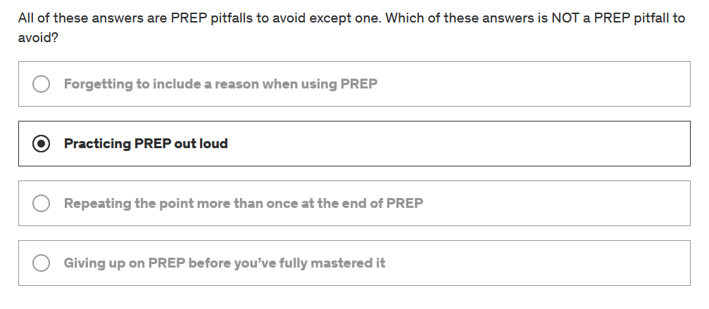
* Manage Your Speech Anxirty
    1. Feel the Fear and Do It Anyway - [America's Top fears](https://www.washingtonpost.com/news/wonk/wp/2014/10/30/clowns-are-twice-as-scary-to-democrats-as-they-are-to-republicans/)
    25. Exercise: Calm Your Body with 4-Square Breathing - [25. Guided+4-Square+Breathing+Exercise.wav](https://github.com/mkader/Public-Speaking-to-Become-a-Leader/blob/2a4cea71cf8ade578bd4b3507466ab615a3294f5/Public%20Speaking%20-%20Foundational/5.%20Speak%20Like%20a%20Pro%3A%20Public%20Speaking%20for%20Professionals/25.%20Guided%2B4-Square%2BBreathing%2BExercise.wav)
    26. Exercise: Name Your Anxiety - [I Named My Anxiety](https://www.sbs.com.au/voices/article/i-named-my-anxiety-clive-and-it-changed-my-life/16h9v3uhb)
    27. How to Get Pumped Before Your Next Presentation - [Research](https://www.hbs.edu/ris/Publication%20Files/xge-a0035325%20(2)_0287835d-9e25-4f92-9661-c5b54dbbcb39.pdf)
    1. Quiz 6: CPE Review Quiz: Section 7
        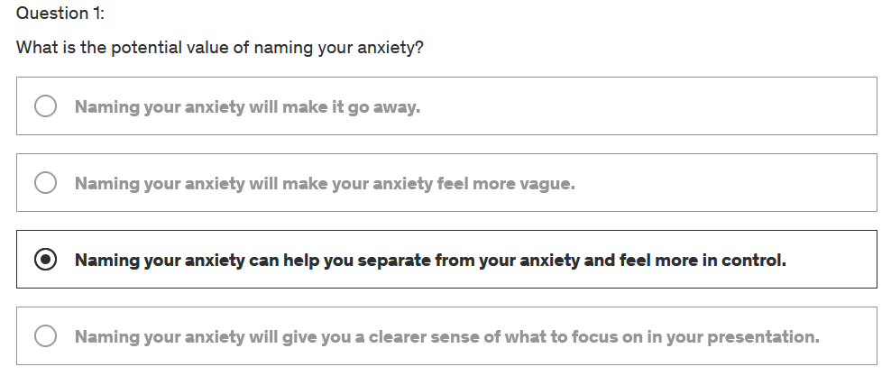
        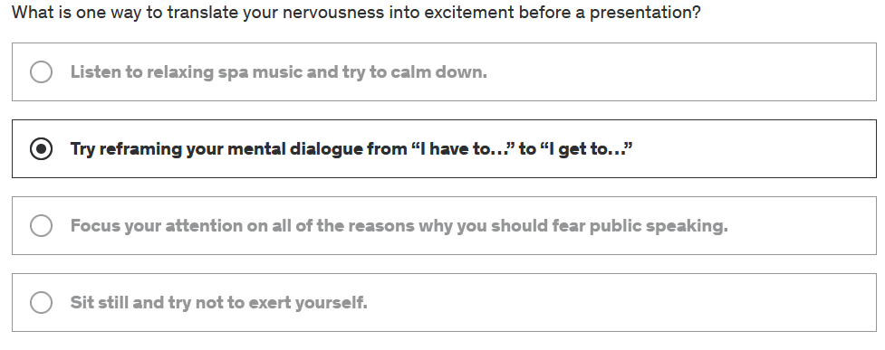
* Next Steps & More Resources
    1. Exercise: Your Takeaways and Commitments
        1. [28. My+Favorite+Public+Speaking+Resources.pdf](https://github.com/mkader/Public-Speaking-to-Become-a-Leader/blob/2a4cea71cf8ade578bd4b3507466ab615a3294f5/Public%20Speaking%20-%20Foundational/5.%20Speak%20Like%20a%20Pro%3A%20Public%20Speaking%20for%20Professionals/28.%20My%2BFavorite%2BPublic%2BSpeaking%2BResources.pdf)
        1. [28. 3+Takeaways+and+3+Commitments+F.pdf](https://github.com/mkader/Public-Speaking-to-Become-a-Leader/blob/2a4cea71cf8ade578bd4b3507466ab615a3294f5/Public%20Speaking%20-%20Foundational/5.%20Speak%20Like%20a%20Pro%3A%20Public%20Speaking%20for%20Professionals/28.%203%2BTakeaways%2Band%2B3%2BCommitments%2BF.pdf)
    29. Master Public Speaking with 1:1 Coaching & Team Training - [29. Jennifer+Hennings+-+Executive+Presentation+Coach+Flyer.pdf](https://github.com/mkader/Public-Speaking-to-Become-a-Leader/blob/2a4cea71cf8ade578bd4b3507466ab615a3294f5/Public%20Speaking%20-%20Foundational/5.%20Speak%20Like%20a%20Pro%3A%20Public%20Speaking%20for%20Professionals/29.%20Jennifer%2BHennings%2B-%2BExecutive%2BPresentation%2BCoach%2BFlyer.pdf)
    1. CPE Qualified Assessment
        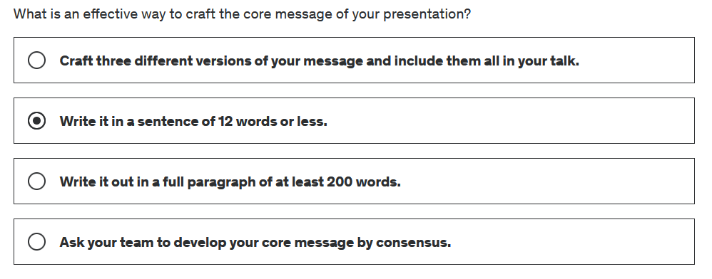
        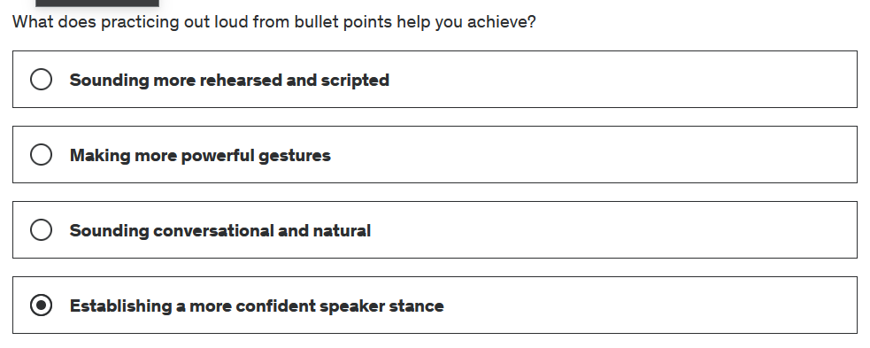
        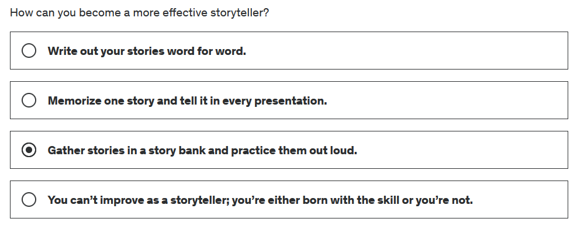
        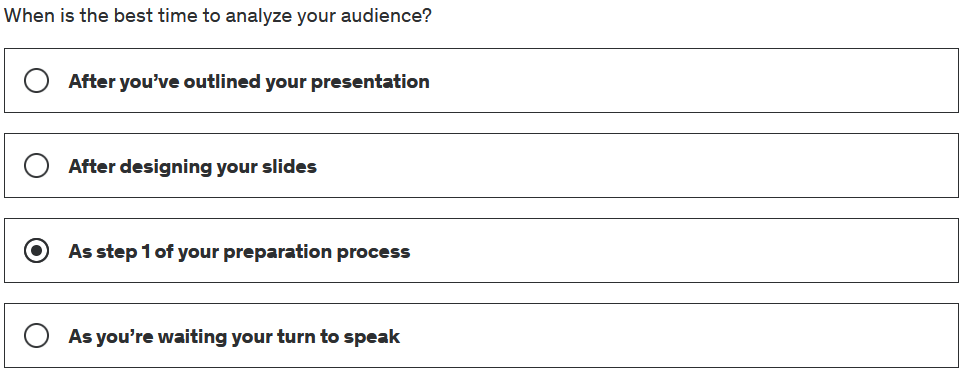
        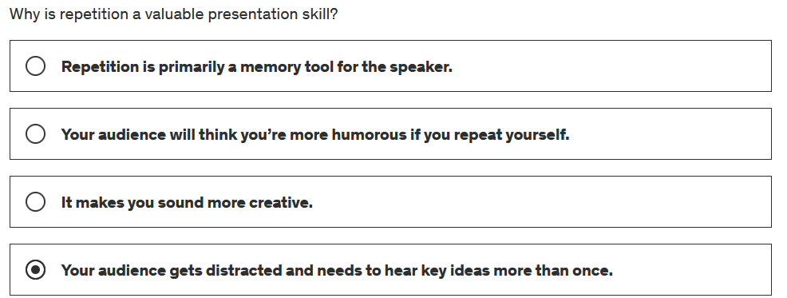
        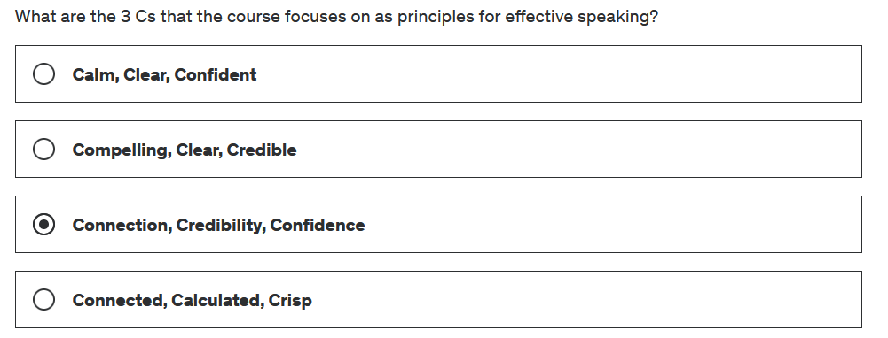
        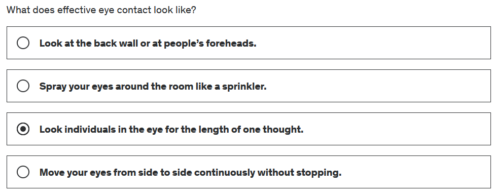
        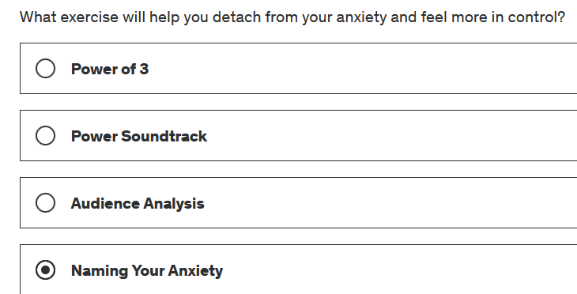
        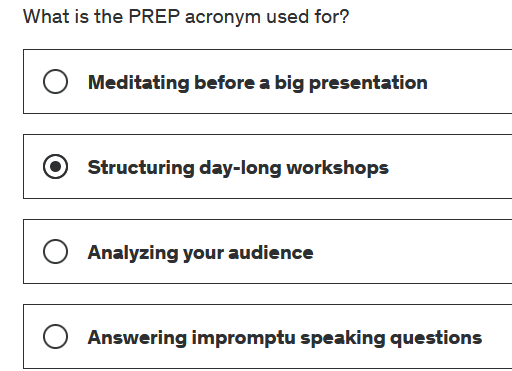
        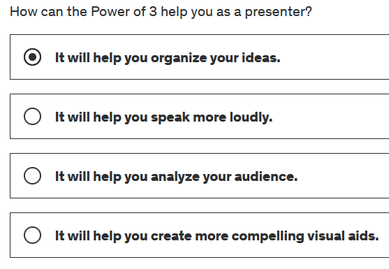